# Introduction

In the realm of financial inclusion, the accessibility of emergency funds plays a pivotal role in determining an individual's financial stability and resilience, especially in developing countries.[@10.1093/oso/9780198827535.003.0007] In this project, our goal is to predict the possibility for people in Sub-Saharan African countries to come up with emergency funds, defined as 1/20 of GNI per capita in local currency, within a 30-day period[ @Demirguc-Kunt2022]. This prediction serves as a crucial factor for establishing future public financial policies, such as determining the eligibility of individuals for loans and financial assistance. The significance of this problem lies within its direct impact on the economic well-being and empowerment of individuals in developing regions. According to the [Global Financial Inclusion (Global Findex) Database 2021](https://www.worldbank.org/en/publication/globalfindex) published by the World Bank, only a little over half of people over 15 years of age in developing economies could access extra funds within 30 days if faced with unexpected expenses [@Demirguc-Kunt2022]. Therefore, there is a pressing need to understand the factors influencing this accessibility and eliminate inherent bias in the dataset. By delving into this issue, we not only contribute to enhancing financial inclusion but also aid in mitigating the different effects of financial shocks on vulnerable populations.

Defining fairness is essential since the concept itself is relative among different people. In the data science discourse, fairness encompasses three key aspects: individual fairness, group fairness, and causal fairness[@Kypraiou2021What]. Individual fairness focuses on preventing discrimination against individuals with similar relevant characteristics. This means ensuring that individuals in similar situations receive similar outcomes from the model, regardless of irrelevant factors[@10.1145/3461702.3462621]. Group fairness aims to prevent disparities in outcomes for different groups. This ensures equal opportunities for all groups, regardless of their membership[@10.1145/3442188.3445876]. Causal fairness goes beyond simply observing disparities and delves into understanding their underlying causes. It seeks to mitigate these root causes to achieve fair outcomes within and across groups[@plecko2022causal].

Our previous colleagues conducted analysis using the \<AI & Equality\> Human Rights Toolbox and used a Decision Tree Classifier machine learning model implemented via Python to predict access to emergency funds with 68% accuracy. Their work laid a solid foundation by exploring demographic and financial variables within the dataset, and assessed the fairness of the decision tree classifier, particularly concerning gender bias, and then applied various processing techniques to enhance the fairness of the model[@Porta2022].

Based on their work, our group aims to incorporate synthetic data to rebalance the dataset, ensuring equitable representations amongst both genders in the dataset. Our approach aims to consider a broader selection of machine learning algorithms and mitigate the disparities the previous colleagues found in the decision tree’s classifier’s predictions and enhance fairness with synthetic data, ultimately better predict access to emergency funds in south-Saharan Africa countries[@SyntheticDataAIEquality].

# Background on Sub-Saharan Region

Sub-Saharan Africa is a region characterized by a diverse economic landscape, encompassing low, lower-middle, and upper-middle-income countries. Demographically, Sub-Saharan Africa is marked by a rich tapestry of cultures and a population exceeding 1.2 billion people. This expansive and diverse demographic landscape includes 22 countries grappling with fragility or conflict, posing unique challenges to development efforts. Additionally, 13 small states within the region are characterized by limited human capital, modest populations, and constrained land areas. 

According to the World Bank's definition, middle-income countries had a per capita gross national income of more than US$995.00 in the years 2015–17. Among the 35 countries included in our dataset, 20 are classified as low-income countries, and 15 are classified as middle-income countries. Additionally, 11 are classified as countries in Fragile and Conflict-Affected Situations, which, by definition, have experienced a peacekeeping or peace-building mission within the last three years.

Sub-Saharan African countries not only differ in terms of economic prosperity but also in economic structure and resource intensity. Resource-intensive countries include both oil-exporting nations, where net oil exports make up 30 percent or more of total exports, and commodity exporters, where nonrenewable natural resources represent 25 percent or more of total exports. The divergence between resource-intensive and non-resource-intensive countries became more entrenched following the commodity price shock of 2015. Non-resource-intensive countries have proven more resilient, supported by their more diversified economies. On the other hand, resource-intensive economies generally have a less diversified structure, making them more susceptible to external shocks. In our dataset, 6 of the countries are oil exporters, and 11 export other commodities such as iron ore, copper, cotton, coffee, and sugar. The remaining 18 countries are non-resource-intensive and their economies are not reliant on exports.

In recent years, the Sub-Saharan Africa region has grappled with significant economic challenges, including soaring inflation, pronounced exchange rate pressures, debt vulnerabilities, and widening economic disparities within the region. Therefore, addressing these structural and economic disparities is imperative for tackling developmental issues in the region.

```{r eval=FALSE, message=FALSE, warning=FALSE, include=FALSE}
library(gapminder)
library(ggplot2)
library(plotly)
library(dplyr)
library(readxl)
library(leaflet)
library(sf)
library(RColorBrewer)

gdpPercap <- read.csv("df_3.csv")

# Filter for African countries and the year 2017
gdpPercap_africa <- gdpPercap[gdpPercap$continent == "Africa" & gdpPercap$year == 2017, ]

# Read the json to create the map
map_geojson <- st_read("map_africa.json")
map_geojson$name_long[24] <- "Cote d'Ivoire"
map_geojson$name_long[11] <- "Congo, Dem. Rep."
map_geojson$name_long[10] <- "Congo, Rep."
map_geojson$name_long[10] <- "Congo, Rep."

# Merge gapminder data with GeoJSON map data
merged_data <- merge(map_geojson, gdpPercap_africa, by.x = "name_long", by.y = "country")

# Assuming gdpPercap is a column in your merged_data
map <- leaflet(merged_data) %>%
  addTiles() %>%
  addPolygons(
    fillColor = ~colorQuantile("YlOrRd", merged_data$gdpPercap)(gdpPercap),
    fillOpacity = 0.7,
    weight = 1,
    color = "white",
    popup = ~paste("Country: ", sovereignt, "<br>GDP per Capita by income quantile: $", gdpPercap)
  ) %>%
  addLegend(
    position = "bottomright",
    pal = colorQuantile("YlOrRd", merged_data$gdpPercap),
    values = merged_data$gdpPercap,
    title = "GDP per Capita",
    opacity = 1
  )

# Display the map
map
```


# Data

In order to continue assessing and enhancing the fairness of the machine learning models, we use the same Global Findex Database as our colleagues before us. The Global Findex database [ ] was first launched in 2011 by the World Bank—with funding from the Bill & Melinda Gates Foundation. It is the world’s most comprehensive data set on how adults save, borrow, make payments, and manage risk. The dataset contains over 200 indicators including account ownership, payments, savings, credit, and financial resilience and has coverage over 140 nations, representing 97% of the world's population for year 2017, 2014, and 2011. 

The data was constructed through a series of surveys carried out by Gallup, Inc in association with the annual Gallup World Poll. They randomly sampled 1000 individuals from each country and asked them to respond to a survey either over the phone or in-person. The target population is the civilian, non-institutionalized population 15 years and above. In consistency with the former colleagues, our sample covers only the Sub-Saharan region (35 countries total), thus there are 35,000 total observations and 105 total variables. Since the sampling was random and the sample size is large, we can assume that our sample is representative of the total population of people living in the 35 Sub-Saharan countries in the data. The data was collected directly from individuals over the 2017 calendar year and is self-contained, meaning it does not rely on any external resources.

## Variable Definition and Descriptions

After basic data cleaning, we have created various visualizations to help understand who is in the data and acknowledge potential sources of bias within the data. 

``` {r,echo=FALSE, fig.show='hold', out.width='50%'}
  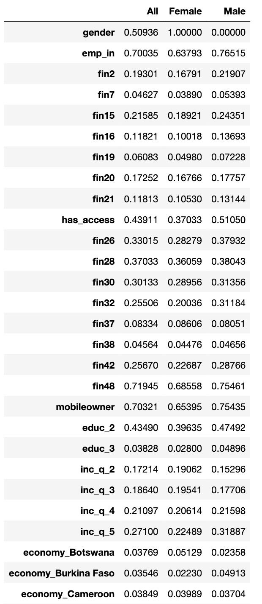 
  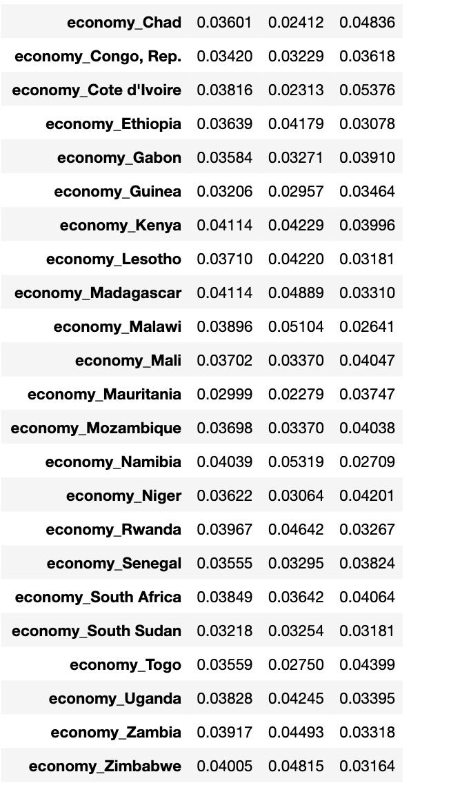
```

*Outcome Variable of Interest: Access to Emergency Fund (Fin24)*

The variable “Fin24” in the dataset asked participants the question: Now, imagine that you have an emergency and you need to pay [1/20 of GNI per capita in local currency]. Is it possible or not possible that you could come up with [1/20 of GNI per capita in local currency] within the NEXT MONTH? In order to make it more straightforward for interpretations, we restrict the response into a binary variable for Yes and No. The overall distribution of access to emergency funds showed 17, 599 individuals had access to emergency funds while 14342 did not. This indicates that over half of individuals represented in the data do not have access to emergency funds.

To help conceptually understand how the outcome variables might vary among different levels of the variables, we chose 50% as the benchmark proportion for checking if the possibility of coming up with emergency funds for each variable group of interest is different from a random 50/50 chance.
``` {r, out.width='70%', fig.align='center', fig.cap='Distribution of having emergency fund', echo=FALSE}
     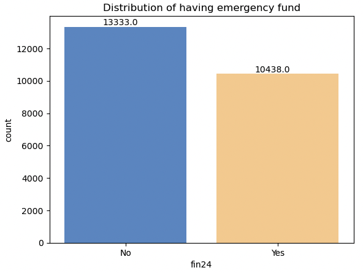 
```

*Protected Attribute of Focus: Gender (female)*

The variable “female” distinguishes gender. There are 12108 females and 11663 males in the dataset. It appears to have a fair distribution between different genders for the dataset as a whole. 
```{r, out.width='100%', fig.align='center', fig.cap='Distribution on gender', echo=FALSE, fig.show='hold'}
     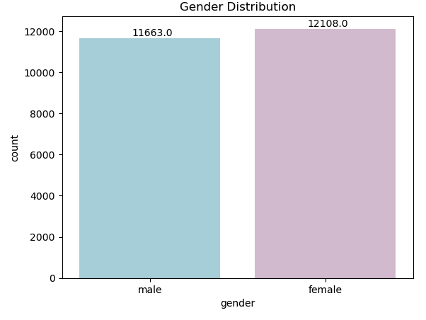 
```

While it looks quite balanced in the previous figure, we observe a discrepancy between the two genders when compared against our outcome variable of interest. Females have a 15% lower chance of having access to emergency funds. 
``` {r, out.width='100%', fig.align='center', fig.cap='Distribution of having emergency fund by gender', echo=FALSE}
     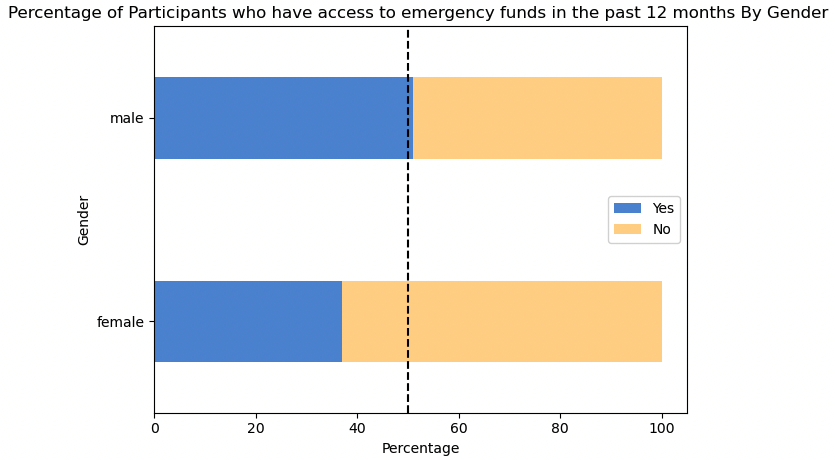 
```

In order to investigate further into how discrepancy of gender plays into other predictor variables, we created visuals for contrasting the two genders. 

*Education (educ)*

The variable “educ” distinguishes education level among participants: 1 being the completed primary education or less, 2 being completed secondary education, and 3 being completed tertiary education. The majority in the dataset is participants with primary or less education (12523 participants). On the other hand, there are only 910 participants who have tertiary education. Overall, the discrepancy between education levels appears quite drastic, and might result in a varying prediction for access to emergency funds. If we break down education by gender,  we see that more females than males have primary or less education while the opposite for secondary or tertiary education. 
``` {r, out.width='100%', fig.align='center', fig.cap='Distribution by education level', echo=FALSE}
     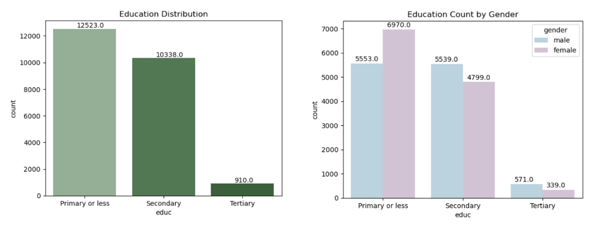 
```

When we consider gender and education with respect to the outcome variable of interest, we observe that tertiary education levels have the highest likelihood of access to emergency funds while primary education is the least likely. 
``` {r, out.width='100%', fig.align='center', fig.cap='Distribution of access to emergency funds by education level and gender', echo=FALSE}
     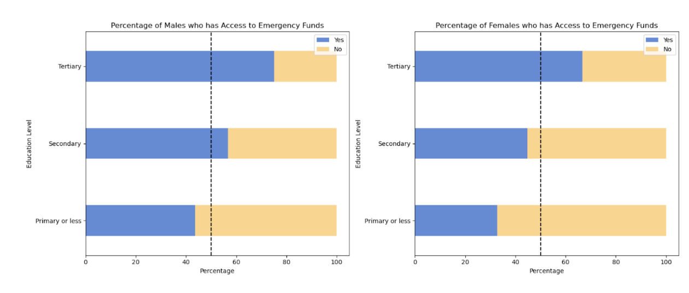 
```
This discrepancy between education levels is reasonable since participants with tertiary education might have been more financially independent and have higher financial resilience, thus be more likely to have access to emergency funds. Nonetheless, we continue to observe that females have a lower access to emergency funds, among the same education level. It shows that gender imbalance is still evident when we position it in relationship to other predictors. 


*Income Quantile (Inc_q)*

The variable “inc_q” distinguishes the income quintile within an economy. It is separated into 5 quantiles with 1 being the poorest and 5 being the richest. Income quintile 5, or the richest 20%, is the largest quantile.  There are more male than females in the  richest 20% quintile, while females compose the majority of the poorest 20%, second poorest 20%, and middle 20%, which are the poorest quantiles.

``` {r, out.width='100%', fig.align='center', fig.cap='Income Quantile Distribution', echo=FALSE}
     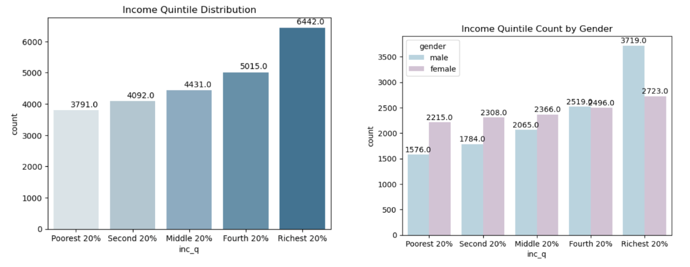 
```
We observe a similar gradient in access to emergency funds among the different income quintiles. This discrepancy is expected since participants with the level of income are directly related to financial stability and resilience. However, the gap between females and male is still concerning: male that are in the top two income quintile will have at least 50% chance of access to emergency funds, whereas only females that are the top 1 income quintile will have a comparable likelihood. 
``` {r, out.width='100%', fig.align='center', fig.cap='Distribution of access to emergency funds by income quantiile and gender', echo=FALSE}
     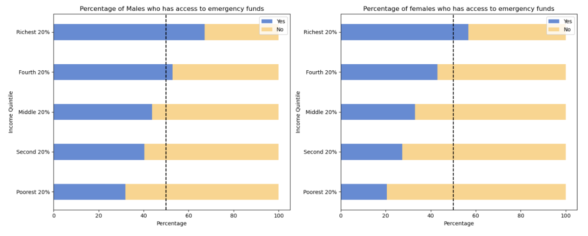 
```

*Employment Status (emp_in)*

Employment Status asks whether or not the participant is in the workforce. There are 16648 individuals who were in the workforce while 7123 were not, and more females are out of the workforce than males, thus suggesting that females are less likely to achieve economic independence than males. 
``` {r, out.width='100%', fig.align='center', fig.cap='Distribution of employment status', echo=FALSE}
     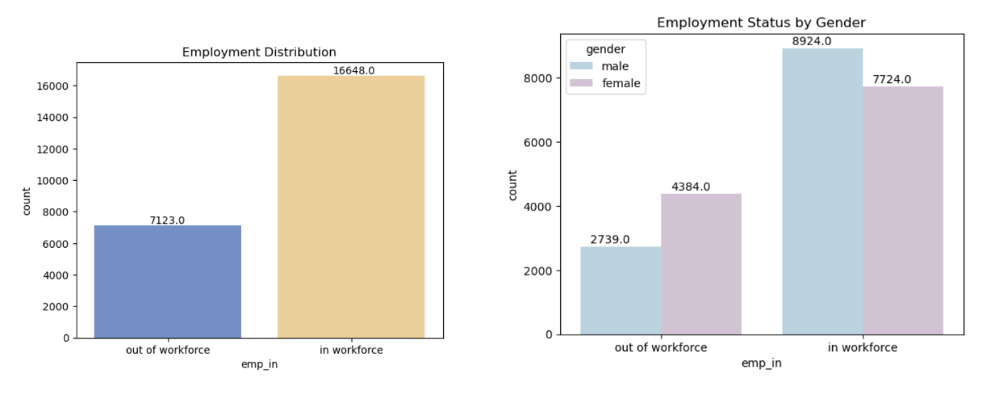
```
The disparity between females and male is quite alarming when we break it down by employment status. Regardless of the employment status, females do not even have a 50% chance of having access to emergency funds.
``` {r, out.width='100%', fig.align='center', fig.cap='Distribution of access to emergency funds by employment status and gender', echo=FALSE}
     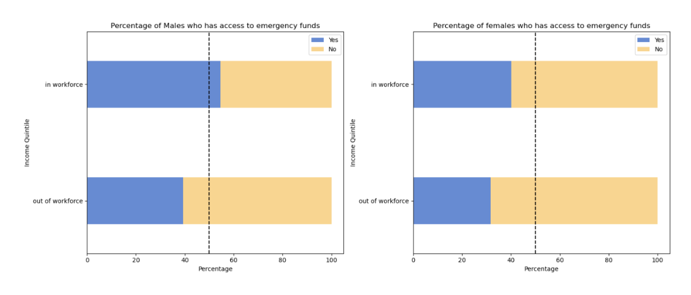
```

*Country (economy)*

The “economy” variable represents the country that the participants live in. There are 27 different countries from Sub-Saharan Africa with around 800-900 respondents each. The countries included are Benin, Botswana, Burkina Faso, Cameroon, Central African Republic, Chad, Congo Dem. Rep. Congo Rep., Côte d’Ivoire, Ethiopia, Gabon, Ghana, Guinea, Kenya, Lesotho, Liberia, Madagascar, Malawi, Mali, Mauritania, Mozambique, Namibia, Niger, Nigeria, Rwanda, Senegal, Sierra Leone, South Africa, South Sudan, Tanzania, Togo, Uganda, Zambia, and Zimbabwe.

While looking at the outcome variable of interest broken down by country and gender, we see that Liberia has the highest proportion of both females and male having access to emergency funds, while Zambia has the lowest proportion of accessing emergency funds in both females and males. It’s also important to note that the difference between males and females is largest in countries like Botswana and Kenya. 
``` {r, out.width='100%', fig.align='center', fig.cap='Distributions of Access to Emergency Funds by country and gender', echo=FALSE}
     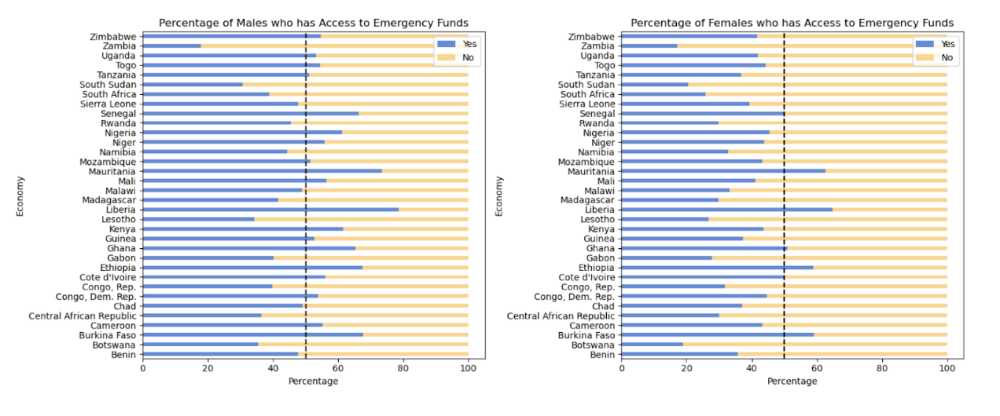
```

We iterate the visualizations for each main financial variable of interest in the dataset by gender, by gender and economy, and by gender and education level, to check if there’s recurring discrepancy among genders. Due to the page constraints, we decide to not include all visualizations and attach our Jupyter Notebook for reference. 
