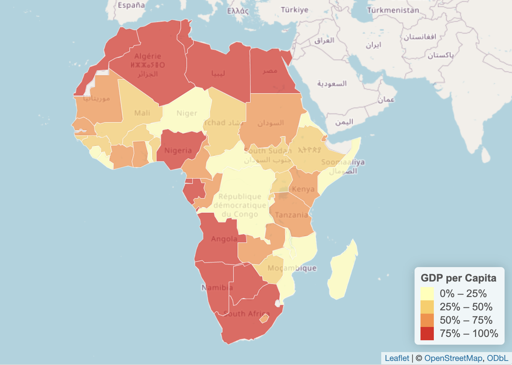
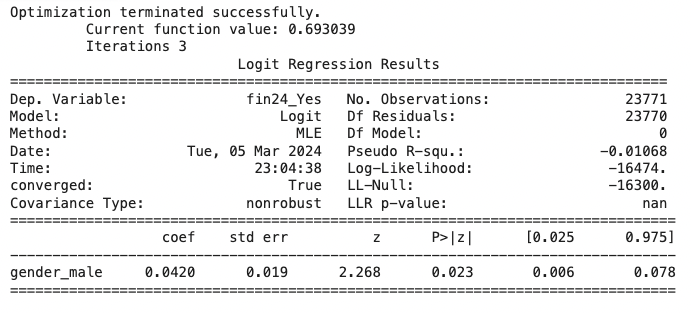
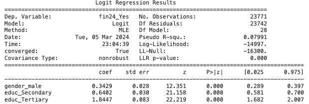
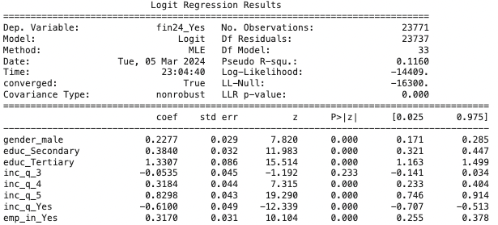

# Introduction

In the realm of financial inclusion, the accessibility of emergency funds plays a pivotal role in determining an individual's financial stability and resilience, especially in developing countries [@10.1093/oso/9780198827535.003.0007]. In this project, our goal is to predict the possibility for people in Sub-Saharan African countries to come up with emergency funds, defined as 1/20 of GNI per capita in local currency, within a 30-day period[ @Demirguc-Kunt2022]. This prediction serves as a crucial factor for establishing future public financial policies, such as determining the eligibility of individuals for loans and financial assistance. The significance of this problem lies within its direct impact on the economic well-being and empowerment of individuals in developing regions. According to the [Global Financial Inclusion (Global Findex) Database 2021](https://www.worldbank.org/en/publication/globalfindex) published by the World Bank, only a little over half of people over 15 years of age in developing economies could access extra funds within 30 days if faced with unexpected expenses [@Demirguc-Kunt2022]. Therefore, there is a pressing need to understand the factors influencing this accessibility and eliminate inherent bias in the dataset. By delving into this issue, we not only contribute to enhancing financial inclusion but also aid in mitigating the different effects of financial shocks on vulnerable populations.

Defining fairness is essential since the concept itself is relative among different people. In the data science discourse, fairness encompasses three key aspects: individual fairness, group fairness, and causal fairness[@Kypraiou2021What]. Individual fairness focuses on preventing discrimination against individuals with similar relevant characteristics. This means ensuring that individuals in similar situations receive similar outcomes from the model, regardless of irrelevant factors[@10.1145/3461702.3462621]. Group fairness aims to prevent disparities in outcomes for different groups. This ensures equal opportunities for all groups, regardless of their membership[@10.1145/3442188.3445876]. Causal fairness goes beyond simply observing disparities and delves into understanding their underlying causes. It seeks to mitigate these root causes to achieve fair outcomes within and across groups[@plecko2022causal].

Our previous colleagues conducted analysis using the \<AI & Equality\> Human Rights Toolbox and used a Decision Tree Classifier machine learning model implemented via Python to predict access to emergency funds with 68% accuracy. Their work laid a solid foundation by exploring demographic and financial variables within the dataset, and assessed the fairness of the decision tree classifier, particularly concerning gender bias, and then applied various processing techniques to enhance the fairness of the model[@Porta2022].

Based on their work, our group aims to incorporate synthetic data to rebalance the dataset, ensuring equitable representations amongst both genders in the dataset. Our approach aims to consider a broader selection of machine learning algorithms and mitigate the disparities the previous colleagues found in the decision tree’s classifier’s predictions and enhance fairness with synthetic data, ultimately better predict access to emergency funds in south-Saharan Africa countries[@SyntheticDataAIEquality].

## Background on Sub-Saharan Region

Sub-Saharan Africa is a region characterized by a diverse economic landscape, encompassing low, lower-middle, and upper-middle-income countries. Demographically, Sub-Saharan Africa is marked by a rich tapestry of cultures and a population exceeding 1.2 billion people. This expansive and diverse demographic landscape includes 22 countries grappling with fragility or conflict, posing unique challenges to development efforts. Additionally, 13 small states within the region are characterized by limited human capital, modest populations, and constrained land areas [ADD CITATION]. 

``` {r,echo=FALSE, fig.align='center', fig.show='hold', out.width='70%'}
   
```

According to the World Bank's definition, middle-income countries had a per capita gross national income of more than US$995.00 in the years 2015–17 [ADD CITATION]. Among the 35 countries included in our dataset, 20 are classified as low-income countries, and 15 are classified as middle-income countries. Additionally, 11 are classified as countries in Fragile and Conflict-Affected Situations, which, by definition, have experienced a peacekeeping or peace-building mission within the last three years.

Sub-Saharan African countries not only differ in terms of economic prosperity but also in economic structure and resource intensity. Resource-intensive countries include both oil-exporting nations, where net oil exports make up 30 percent or more of total exports, and commodity exporters, where nonrenewable natural resources represent 25 percent or more of total exports. The divergence between resource-intensive and non-resource-intensive countries became more entrenched following the commodity price shock of 2015 [ADD CITATION]. Non-resource-intensive countries have proven more resilient, supported by their more diversified economies. On the other hand, resource-intensive economies generally have a less diversified structure, making them more susceptible to external shocks. In our dataset, 6 of the countries are oil exporters, and 11 export other commodities such as iron ore, copper, cotton, coffee, and sugar. The remaining 18 countries are non-resource-intensive and their economies are not reliant on exports.

In recent years, the Sub-Saharan Africa region has grappled with significant economic challenges, including soaring inflation, pronounced exchange rate pressures, debt vulnerabilities, and widening economic disparities within the region. Therefore, addressing these structural and economic disparities is imperative for tackling developmental issues in the region.

```{r eval=FALSE, message=FALSE, warning=FALSE, include=FALSE}
library(gapminder)
library(ggplot2)
library(plotly)
library(dplyr)
library(readxl)
library(leaflet)
library(sf)
library(RColorBrewer)

gdpPercap <- read.csv("df_3.csv")

# Filter for African countries and the year 2017
gdpPercap_africa <- gdpPercap[gdpPercap$continent == "Africa" & gdpPercap$year == 2017, ]

# Read the json to create the map
map_geojson <- st_read("map_africa.json")
map_geojson$name_long[24] <- "Cote d'Ivoire"
map_geojson$name_long[11] <- "Congo, Dem. Rep."
map_geojson$name_long[10] <- "Congo, Rep."
map_geojson$name_long[10] <- "Congo, Rep."

# Merge gapminder data with GeoJSON map data
merged_data <- merge(map_geojson, gdpPercap_africa, by.x = "name_long", by.y = "country")

# Assuming gdpPercap is a column in your merged_data
map <- leaflet(merged_data) %>%
  addTiles() %>%
  addPolygons(
    fillColor = ~colorQuantile("YlOrRd", merged_data$gdpPercap)(gdpPercap),
    fillOpacity = 0.7,
    weight = 1,
    color = "white",
    popup = ~paste("Country: ", sovereignt, "<br>GDP per Capita by income quantile: $", gdpPercap)
  ) %>%
  addLegend(
    position = "bottomright",
    pal = colorQuantile("YlOrRd", merged_data$gdpPercap),
    values = merged_data$gdpPercap,
    title = "GDP per Capita",
    opacity = 1
  )

# Display the map
map
```

# Data

In order to continue assessing and enhancing the fairness of the machine learning models, we use the same Global Findex Database as our colleagues before us[@Porta2022]. The Global Findex database was first launched in 2011 by the World Bank—with funding from the Bill & Melinda Gates Foundation. It is the world’s most comprehensive data set on how adults save, borrow, make payments, and manage risk. The dataset contains over 200 indicators including account ownership, payments, savings, credit, and financial resilience and has coverage over 140 nations, representing 97% of the world's population for year 2017, 2014, and 2011[@Demirguc-Kunt2022]. 

The data was constructed through a series of surveys carried out by Gallup, Inc in association with the annual Gallup World Poll. They randomly sampled 1000 individuals from each country and asked them to respond to a survey either over the phone or in-person. The target population is the civilian, non-institutionalized population 15 years and above. In consistency with the former colleagues, our sample covers only the Sub-Saharan region (35 countries total), thus there are 35,000 total observations and 105 total variables. Since the sampling was random and the sample size is large, we can assume that our sample is representative of the total population of people living in the 35 Sub-Saharan countries in the data. The data was collected directly from individuals over the 2017 calendar year and is self-contained, meaning it does not rely on any external resources.

After basic data cleaning, we have created various visualizations to help understand who is in the data and acknowledge potential sources of bias within the data. 

``` {r,echo=FALSE, fig.show='hold', out.width='40%'}
  knitr::include_graphics('graphs/var1_graph.jpeg') 
  knitr::include_graphics('graphs/var2_graph.jpeg')
```

## *Outcome Variable of Interest: Access to Emergency Fund (Fin24)*

The variable “Fin24” in the dataset asked participants the question: Now, imagine that you have an emergency and you need to pay [1/20 of GNI per capita in local currency]. Is it possible or not possible that you could come up with [1/20 of GNI per capita in local currency] within the NEXT MONTH[@Demirguc-Kunt2022]? In order to make it more straightforward for interpretations, we restrict the response into a binary variable for Yes and No. The overall distribution of access to emergency funds showed 17,599 individuals had access to emergency funds while 14,342 did not. This indicates that over half of individuals represented in the data do not have access to emergency funds.

To help conceptually understand how the outcome variables might vary among different levels of the variables, we chose 50 % as the benchmark proportion for checking if the possibility of coming up with emergency funds for each variable group of interest is different from a random 50/50 chance.
``` {r, out.width='70%', fig.align='center', fig.cap='Distribution of having emergency fund', echo=FALSE}
     knitr::include_graphics('graphs/f24_graph1.png') 
```
## Demographics
### *Protected Attribute of Focus: Gender (female)*

The variable “female” distinguishes gender. There are 12,108 females and 11,663 males in the dataset. It appears to have a fair distribution between different genders for the dataset as a whole. 
```{r, out.width='100%', fig.align='center', fig.cap='Distribution on gender', echo=FALSE, fig.show='hold'}
     knitr::include_graphics('graphs/f24_graph2.png') 
```

While it looks quite balanced in the previous figure, we observe a discrepancy between the two genders when compared against our outcome variable of interest. Females have a 15% lower chance of having access to emergency funds. 
``` {r, out.width='100%', fig.align='center', fig.cap='Distribution of having emergency fund by gender', echo=FALSE}
     knitr::include_graphics('graphs/f24_graph3.png') 
```

In order to investigate further into how discrepancy of gender plays into other predictor variables, we created visuals for contrasting the two genders. 

### *Education (educ)*

The variable “educ” distinguishes education level among participants: 1 being the completed primary education or less, 2 being completed secondary education, and 3 being completed tertiary education. The majority in the dataset is participants with primary or less education (12523 participants). On the other hand, there are only 910 participants who have tertiary education. Overall, the discrepancy between education levels appears quite drastic, and might result in a varying prediction for access to emergency funds. If we break down education by gender,  we see that more females than males have primary or less education while the opposite for secondary or tertiary education. 
``` {r, out.width='100%', fig.align='center', fig.cap='Distribution by education level', echo=FALSE}
     knitr::include_graphics('graphs/f24_graph4.png') 
```

When we consider gender and education with respect to the outcome variable of interest, we observe that tertiary education levels have the highest likelihood of access to emergency funds while primary education is the least likely. 
``` {r, out.width='100%', fig.align='center', fig.cap='Distribution of access to emergency funds by education level and gender', echo=FALSE}
     knitr::include_graphics('graphs/f24_graph5.png') 
```
This discrepancy between education levels is reasonable since participants with tertiary education might have been more financially independent and have higher financial resilience, thus be more likely to have access to emergency funds. Nonetheless, we continue to observe that females have a lower access to emergency funds, among the same education level. It shows that gender imbalance is still evident when we position it in relationship to other predictors. 


### *Income Quantile (Inc_q)*

The variable “inc_q” distinguishes the income quintile within an economy. It is separated into 5 quantiles with 1 being the poorest and 5 being the richest. Income quintile 5, or the richest 20%, is the largest quantile.  There are more male than females in the  richest 20% quintile, while females compose the majority of the poorest 20%, second poorest 20%, and middle 20%, which are the poorest quantiles.

``` {r, out.width='100%', fig.align='center', fig.cap='Income Quantile Distribution', echo=FALSE}
     knitr::include_graphics('graphs/income_graph6.png') 
```
We observe a similar gradient in access to emergency funds among the different income quintiles. This discrepancy is expected since participants with the level of income are directly related to financial stability and resilience. However, the gap between females and male is still concerning: male that are in the top two income quintile will have at least 50% chance of access to emergency funds, whereas only females that are the top 1 income quintile will have a comparable likelihood. 
``` {r, out.width='100%', fig.align='center', fig.cap='Distribution of access to emergency funds by income quantiile and gender', echo=FALSE}
     knitr::include_graphics('graphs/employ_graph7.png') 
```

### *Employment Status (emp_in)*

Employment Status asks whether or not the participant is in the workforce. There are 16648 individuals who were in the workforce while 7123 were not, and more females are out of the workforce than males, thus suggesting that females are less likely to achieve economic independence than males. 
``` {r, out.width='100%', fig.align='center', fig.cap='Distribution of employment status', echo=FALSE}
     knitr::include_graphics('graphs/employ_graph8.png')
```
The disparity between females and male is quite alarming when we break it down by employment status. Regardless of the employment status, females do not even have a 50% chance of having access to emergency funds.
``` {r, out.width='100%', fig.align='center', fig.cap='Distribution of access to emergency funds by employment status and gender', echo=FALSE}
     knitr::include_graphics('graphs/employ_graph9.png')
```

### *Country (economy)*

The “economy” variable represents the country that the participants live in. There are 27 different countries from Sub-Saharan Africa with around 800-900 respondents each. The countries included are Benin, Botswana, Burkina Faso, Cameroon, Central African Republic, Chad, Congo Dem. Rep. Congo Rep., Côte d’Ivoire, Ethiopia, Gabon, Ghana, Guinea, Kenya, Lesotho, Liberia, Madagascar, Malawi, Mali, Mauritania, Mozambique, Namibia, Niger, Nigeria, Rwanda, Senegal, Sierra Leone, South Africa, South Sudan, Tanzania, Togo, Uganda, Zambia, and Zimbabwe.

While looking at the outcome variable of interest broken down by country and gender, we see that Liberia has the highest proportion of both females and male having access to emergency funds, while Zambia has the lowest proportion of accessing emergency funds in both females and males. It’s also important to note that the difference between males and females is largest in countries like Botswana and Kenya. 
``` {r, out.width='100%', fig.align='center', fig.cap='Distributions of Access to Emergency Funds by country and gender', echo=FALSE}
     knitr::include_graphics('graphs/country_graph10.png')
```

We iterate the visualizations for each main financial variable of interest in the dataset by gender, by gender and economy, and by gender and education level, to check if there’s recurring discrepancy among genders. Due to the page constraints, we decide to not include all visualizations and attach our Jupyter Notebook ([link](https://drive.google.com/file/d/1f9AauOn4I2Rl5io_viMw0WbEXKFiJcRA/view?usp=sharing)) for reference.

## Financial Variables

We describe financial variables that are likely to have an impact on access to emergency fund in the following section.

### *Has a debit card (fin2)*

The variable “fin2” inquired whether participants possessed “a card connected to an account at a financial institution that allows immediate withdrawals of money.” We posit that this variable correlates with the outcome, as a debit card serves both saving and withdrawal purposes, closely intertwining with income accumulation. The absence of a debit card signifies a lack of savings and financial stability, potentially hindering the ability to build emergency funds. Among all participants, 4,588 individuals own a debit card, while 19,183 individuals do not, surpassing the number of cardholders by more than five times. Despite this significant difference, the distribution by gender indicates a relatively similar percentage of males and females owning a debit card. This suggests no conspicuous imbalance in debit card ownership between genders.

### *Has a credit card (fin7)*

The variable “fin7” asked whether participants possessed “a card that allows borrowing to make payments and pay the balance off later.” We hypothesize that this variable correlates with the outcome, as a credit card facilitates immediate access to funds during emergencies and provides flexible repayment options. Notably, only 1,100 individuals, comprising less than 5% of all participants, own a credit card. Despite this contrast, the distribution by gender reveals a relatively similar percentage of males and females owning a credit card. This implies no apparent gender-based imbalance in credit card ownership.

### *Saved for farm/business purposes in the past 12 months (fin15)*
The variable “fin15” asks whether respondents saved money to “start, operate, or grow a business or farm in the past 12 months.” We propose that this variable may correlate with the outcome, as saving for business or farm endeavors suggests a proactive approach towards entrepreneurship or agricultural ventures. Among all participants, 5,131 individuals saved money for business or farm purposes, while 18,640 individuals did not. Examining the gender composition, there is a slightly larger percentage of males who engaged in saving for business or farm compared to females. This observation suggests a gender difference in the inclination to save for entrepreneurial or agricultural pursuits within the surveyed population (5%).

### *Saved for old age in the past 12 months (fin16)*
The variable “fin16” inquires whether respondents saved money for old age in the past 12 months. We propose that this variable may correlate with the outcome, as saving for old age reflects a forward-thinking approach to financial planning and retirement readiness. Among all participants, only 2,810 individuals, constituting a distinct subset, saved money for old age, while 20,961 individuals did not. Analyzing the gender composition, there is a slightly larger percentage of males who engaged in saving for old age compared to females (3.6%). This observation resonates with the trend identified in the variable fin15. These findings collectively suggest a gender difference in the propensity to save for specific financial goals within the surveyed population.

### *Has loan from a financial institution for home, apartment, or land (fin19)*
The variable ‘fin19’ signifies whether a respondent by themself or with someone else currently has a loan that they took out from a bank or another type of formal financial institution to purchase a home, apartment or land. We suspect that the ability to access emergency funds would be impeded by having a loan, because a part of the income would have to be channeled towards repayment. On the other hand, an unspent loan amount could become an emergency fund. In our random sample, 22,325 respondents did not have a loan from a financial institution for a home, apartment, or land, whereas only 1,446 respondents did. In terms of the gender composition, of the respondents who had a loan, there is a slightly larger percentage of males by 2.3% compared to females. 

### *Borrowed in past 12 months: for medical purposes (fin20)*
The variable ‘fin20’ signifies whether a respondent by themself or together with someone else has borrowed money for health or medical purposes in the last 12 months. We suspect that the ability to access emergency funds would be impeded by having borrowed, because a part of the income would have to be channeled towards repayment. Moreover, since the respondent is borrowing for medical purposes, their productivity to generate emergency funds could be argued due to potential illness. In our random sample, 19,670 respondents had not borrowed for medical purposes, whereas only 4,101 respondents did. In terms of the gender composition in the respondents who had borrowed, there is a slightly larger percentage of males by 1% compared to females. 

### *Borrowed for farm/business purposes in past 12 months (Fin21)*
The variable ‘fin21’ signifies whether a respondent by themself or together with someone else has borrowed money to start, operate, or grow a business or farm in the last 12 months. Similar to our argument for Fin20, we suspect that the ability to access emergency funds would be impeded by having borrowed, because a part of the income would have to be channeled towards repayment. In our random sample, 20,963 respondents had not borrowed for medical purposes, whereas only 2,808 respondents did. In terms of the gender composition in the respondents who had borrowed, there is a slightly larger percentage of males by 2.9% compared to females. 

### *Sent domestic remittances in past 12 months (Fin26)*
The variable ‘fin26’ signifies whether a respondent has personally given or sent money to a relative or friend living in a different city or area inside the country in the past 12 months. The money can be given or sent for any reason, and can be money that the respondent brought or sent in some other way. We suspect that the ability to access emergency funds would be encouraged by having voluntarily sent domestic remittances. We hypothesize that the sender of remittances would be less able to access emergency funds given the outflow of their money. In our random sample, 15,923 respondents had not borrowed for medical purposes, whereas only 7,848 respondents did. In terms of the gender composition in the respondents who had sent domestic remittances, there is a larger percentage of males by approximately 9% compared to females. 

### *Received Domestic Remittance in the past 12 months (fin28)*
The variable ‘fin28’ asks whether the respondent has received money from a relative or friend living in a different city or area within the country where the survey is conducted, excluding payments for goods and services, in the past 12 months, requiring a "Yes" or "No" response. We believe that this variable is correlated with the outcome variable because this variable provides insight into the respondent's potential support network and access to financial resources that could be utilized in case of an emergency. In our random sample, 8,803 respondents received domestic remittance in the past 12 months while 14698 respondents did not. In the graph, slightly more male respondents received domestic remittances compared to females (~2%). 

### *Received Government Transfer in the past 12 months (fin37)*
The variable "fin37" asks respondents whether they have personally received any financial support from the government in the past 12 months, including payments for educational or medical expenses, unemployment benefits, subsidy payments, or any type of social benefits, excluding wages or work-related payments. This information is crucial as individuals who have received government financial support may have a higher likelihood of being able to access emergency funds, as they may have access to additional resources or assistance programs. In our random sample, only 1,981 respondents received government transfer, while 21,790 respondents did not. There’s no observable difference between male and female respondents (~0.5%). 

### *Received Government Pension in the past 12 months (fin38)*
The variable ‘fin38’ asks respondents whether they have personally received a pension from the government, military, or public sector in the past 12 months. It is highly related to the outcome variable as individuals receiving pensions may have a stable source of income that could contribute to their ability to access emergency funds. Therefore, the presence or absence of pension income may influence respondents' perceptions of their financial security and ability to meet emergency financial needs. In the random sample, only 1,085 respondents received government pension, while 22,686 respondents did not. There’s no observable difference between male and female respondents (~0.2%). 

### *Having a national ID (fin48)*
The variable ‘fin48’ asks respondents whether they own a national id of the country where the survey is conducted. The possession of a national ID can significantly impact individuals' access to financial services, eligibility for government assistance programs, and employment opportunities. Having a national ID may facilitate the process of obtaining emergency funds by providing access to formal financial institutions, qualifying for social benefits, and streamlining identity verification for transactions, thereby influencing the respondent's ability to meet emergency financial needs within the next month. In the random sample, 72% of respondents owns a national ID of the country where the survey is conducted. There’s an observable 10% difference between male and females, where 10% more males owns a national ID. 

### *Paid utility bills in past 12 months (fin30)*
The variable “fin30” asked the participants if they have “personally, made regular payments for electricity, water, OR trash collection?” We believe this variable is correlated with the outcome since utility bills are typically recurring expenses that are essential for maintaining basic needs. If someone struggles to pay their utility bills, it could indicate that they are living paycheck to paycheck or facing financial strain. In such situations, they may not have the financial flexibility to save for emergencies. In our data, only 9,175 individuals paid utility bills while 22,766 did not. However when we look at the breakdown by gender, male and female have approximately equal proportions which suggest that genders may not directly affect the distribution for the variable. 

### *Received Wage Payment (fin32)*
The variable “fin32” asked the participants if they have “...received any money from an EMPLOYER, in the form of SALARY OR WAGES, for doing work in the PAST 12 MONTHS?” We believe this variable could be necessary for the model because receiving wage payments is one important source of saving for emergency funds. Only 6063 individuals receive wage payments while 17708 do not.There’s a visible 10% difference between Male receiving wage payments compared to Female. 

### *Own a Mobile Phone (mobileowner)*
The variable “mobileowner” is a binary variable where 1 means owns a mobile phone and 0 otherwise. We believe this variable should be included for fitting the model because having a mobile phone enables individuals to quickly reach out for help or access important financial resources, such as online banking or emergency assistance services to address unexpected expenses promptly. The majority of the sample owns a mobile phone, and a slightly higher proportion among male participants.

### *Received agricultural payments in past 12 months (fin42)*
The variable “fin42” asked the participants if they have “...received money from any source for the sale of agricultural products, crops, produce, or livestock in the PAST 12 MONTHS?” We believe this variable could be necessary for the model because receiving agricultural payments is one important source of saving for emergency funds, especially for resource-intensive countries. In the sample, 6102 individuals receive agricultural payments while 17669 do not. There’s a slightly higher proportion of male receiving agricultural payments than females.

# Summary
Overall, our exploratory data analysis (EDA) reveals that there are disparities in the outcome variable access to emergency funds, most significantly with the protected attributes of gender. This choice is not meant to diminish the importance of the other demographic disparities that also have an influence on the access to emergency funds. Nonetheless, the visualizations above show how gender differences persist in all of these features. Therefore, we believe that choosing gender as our primary attribute and addressing the gender imbalance would potentially address the discrepancy we see in the other attributes. Future research could consider addressing multiple protected attributes. In terms of other financial variables, through these visualizations and analysis, we observe that gender differences are less of a concern than the outcome variable, with around an average of 5% or less difference, only with few exceptions like Fin 26 and Fin32 that have a more visible difference of 10%. This helps substantiate our future effort of artificially creating synthetic data that includes more “Yes” to female observations while randomly assigning values to other financial variables.

Having identified the limitations in the data, our next step is to create a baseline machine learning model and assess the model with fairness metrics to determine the best model fit. After that, we aim to improve the model further with synthetic data to further minimize the bias.  

# Methods
For our project, we used the programming language Python on Jupyter Notebook. We collaborated through Google Colab, Google Drive and GitHub. To clean our data and make preliminary visualizations, we used the pandas, matplotlib, numpy packages. To explore chi correlation and logit regression for the statistical component of our EDA, we used statsmodels.api and chi2_contingency method from scipy.stats package. To explore different baseline machine learning models, we mainly used the sklearn packages to instantiate the models and construct the confucian matrices.

## Exploratory Data Analysis (EDA)
The EDA helps us understand who is represented in the data and aids in approaching our final research problem: understanding the factors contributing to an individual’s ability to access and/or generate emergency funds. 

The data set has 105 variables. Hence, the first task at hand was to narrow down the pool of potential features of interest to our research problem and analysis. Firstly, we chose our demographic features of interest that were gender, education level, employment status, income quintile, and economy. These variables are synonymous to protected or sensitive attributes. As previously mentioned, an outcome (of an algorithm) is not considered fair or just, if they are determined mainly based on a protected attribute.  While reading the data description, we saw that some variables are follow-up questions to the previous variables. For example, “fin8” is only asked if the respondent has an account at a financial institution OR has a debit card in their name which is connected to an account. Due to its lack of response completion in those “sub-questions”, we filtered out variables where more than 25% of the entries were NA.  We then filtered out those that have unclear entries labels. For example, the variable “saved” and “borrowed” have unclear labels for its entry of 1 and 0. Although it may be reasonable to assume that 1 would indicate yes and 0 otherwise, we decided to exclude them for the current sprint.  Finally, we shortlisted our potential predictor down to 16 variables. We built on the previous group’s work by exploring countries for each of the 16 financial variables, because we wanted to see to what extent each variable had predictive power for the outcome variables. 

After selecting a pool of features we were interested to explore, we standardized the data by re-coding it. In the survey, for specially financial features, respondents either answered ‘Yes’, ‘No’, ‘Don’t Know’ or ‘Refuse’. We filtered out ‘Don’t Know’ and ‘Refuse’ responses for our variables, because given the low proportion of those responses for a question, we were skeptical of overfitting and have little relevance to our research problem. After re-coding, every financial variable as well as the outcome are now binary, where 1 indicates yes to the survey questions and 0 indicates no. We want to mention that these steps are in agreement with the data cleaning methodology implemented by the previous colleagues. 

We visualized the characteristics of the population included in the data, through multivariate bar-plots. For each of the features we chose, we created plots displaying the proportion of the respondents who said “Yes” or “No” for a financial variable, for example, fin2 (Owns a debit card) for gender, education level and country. We performed this analysis on all of our shortlisted variables of interest. The main aim of this approach to our EDA was to investigate any potential discrepancies between the responses of male and female, primary, secondary and tertiary education and each country. 

After visualization, we decided to enhance our EDA with two statistical components. First, we ran logit regression with our binary outcome variable i.e. access to emergency funds. Our first regression specification in Fig EDA.1 shows that males have a 4.2 percentage points higher likelihood of having access to emergency funds than their female counterparts with statistical significance. This regression suffers from omitted variable bias (OVB) and we suspect that the impact of gender on access to emergency funds is underestimated. 

``` {r, out.width='100%', fig.align='center', fig.cap='EDA Regression 1', echo=FALSE}
     
```

In our second specification in Fig EDA.2 where we take into account the economy and education level features (which are the two other protected attributes that we explored), the likelihood of access to emergency funds is, on average, 34.75 percentage points higher for men with primary education from Benin than for comparable females with statistical significance. In other words, the reference category is an average male from Benin with primary education These results further emphasize that gender does have an impact on access to emergency funds where females are disadvantaged. Furthermore, these results emphasize that higher levels of education result in greater access of emergency funds with statistical significance, holding all else constant, which confirms our initial hypothesis.

``` {r, out.width='100%', fig.align='center', fig.cap='EDA Regression 2', echo=FALSE}
     
```

In our third specification in Fig EDA.3, we incorporate all the other financial features to control for them in the impact of gender on access to emergency funds and explore their impacts. We observe that unemployed men from Benin with primary education and in the first income quintile, on average, have a 14.45 percentage point higher likelihood than comparable females of access to emergency funds with statistical significance. Hence, we see that gender is still a statistically significant factor in determining access to emergency funds where females are disadvantaged. These logit regressions help to see that we may need to balance our data before training the algorithm that determines who gets access to a loan. 

``` {r, out.width='100%', fig.align='center', fig.cap='EDA Regression 3', echo=FALSE}
     
```

Second, we defined a function to analyze the correlation between the features in our dataset using a Youtube video [@ML_explained]. Since the majority of the features are categorical variables, we had to employ the chi-squared test to evaluate the statistical significance of the correlation between variables. In other words, the function informed us whether there is a correlation or not. However, the function would not show the strength and direction of the correlation. Not having this information was a limitation to potentially selecting proxy variables. Nonetheless, the yes/no correlation output was intuitive as we tested the correlation between gender and access to emergency funds. The output supported the results from the logit regressions that gender does have an impact on the access to emergency funds.

## Baseline Model
In order to improve fairness of the dataset, we need to establish a baseline model to assess its performance before and after the inclusion of synthetic data. Previous group adopted a Decision Tree classification model over a logistic regression model because of its higher accuracy score. However, our group decided not to take their model as granted for two reasons. First, we took a slightly different approach in limiting our predictor variables. This means that our calculated accuracy score does not match entirely with theirs. Furthermore, the cross validations subsets vary based on different random generator seeding, thus it is unreliable to compare its model performance simply based on cross validation results of R-squared. Second, although comparing accuracy across different models is an industry convention, higher accuracy scores might not necessarily mean maximal fairness. A model could have high accuracy in predicting female’s access to emergency funds, but it might not be fair if females have consistently lower likelihood. 

Thus, we believe that it is important to consider a broader range of classification machine learning models to ensure robustness and reliability in predicting access to emergency funds. We acknowledged that each model has its own strengths and weaknesses, and by evaluating a variety of models against our fairness metrics of choice, we can derive an optimal baseline model that not only is fair, but also has good accuracy and interpretability. We explore a total of 6 machine learning models and provides a brief explanation of each model below: 

  1. Logistic Regression provides a simple and interpretable approach, suitable for understanding for binary classification in terms of probability. It works well with a large number of predictors and it is computationally efficient, but it only works best when modeling for linear relationships.
  
  2. K-Nearest Neighbors (KNN) leverages proximity-based classification which classifies instances based on the majority vote of their k nearest neighboring observation in the feature space.  It performs well in situations where the decision boundary is highly irregular or the data is not linearly separable, but it may be too computationally heavy, especially for large datasets. 
  
  3. Support Vector Machines (SVM) are effective for complex decision boundaries and can handle high-dimensional data well. Naive Bayes offers simplicity and efficiency, assuming independence between features, making it suitable for large datasets. 

  4. Decision Trees provide intuitive decision-making processes, while Random Forests offer improved robustness and generalization by combining multiple decision trees.

Going forward, we will compare across different machine models against our fairness metrics of choice as well as other performance metrics such as accuracy, precision, recall, F1 scores, support. We will also construct confucian matrix to visualize the extent of each model in successfully predicting true positives and true negatives for each sex. By Sprint 2, we will have chosen an optimal machine learning model to fit our current dataset and apply synthetic data. 


